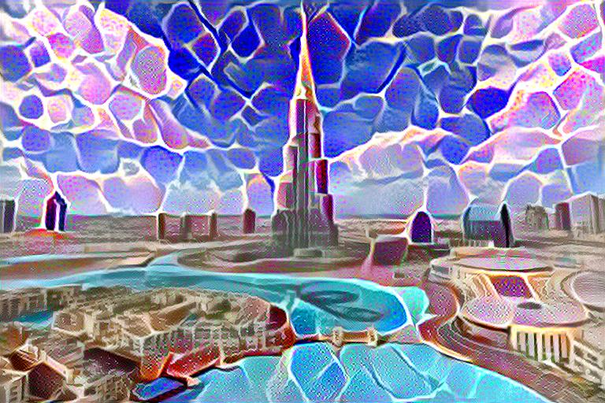

# Natural Style Transfer with L-BFGS
*Individual Assignment – Generative Deep Learning*

---

## 🖼️ Project Description
This project implements **Natural Style Transfer (NST)** using the **L-BFGS optimizer** and a pretrained **VGG19** network.  
The goal is to blend two images:

- **Content Image** → Burj Khalifa  
- **Style Image** → Mosaic texture  

The resulting output preserves the main structure of the Burj Khalifa while applying the mosaic artistic pattern across the entire image.

This work is based on the Week 2 module of **Generative Deep Learning**.

---

## ⚙️ Key Techniques
- Pretrained **VGG19 feature extractor**
- **Content Loss** and **Style Loss**
- **Gram Matrix** for style representation
- **L-BFGS optimization**
- **Non-concat processing** — supports different content/style image sizes  
- Output resolution: **512 × 768 px**

---

## 📁 Project Structure
```
|-- content.png                   # Content image (Burj Khalifa)
|-- style.png                     # Style image (Mosaic)
|-- stylized_result_512x768.jpeg  # Final stylized output
|-- NST_LBFGS.ipynb               # Google Colab notebook
|-- README.md                     # Documentation
```

---

## 🚀 How to Run the Project
1. Upload the notebook (`NST_LBFGS.ipynb`) to Google Colab  
2. Place your content and style images in Google Drive  
3. Update the file paths inside the notebook  
4. Run the notebook sequentially:

   - Step 1 → Install & import libraries  
   - Step 2 → Load & preprocess images  
   - Step 3 → Google Drive paths  
   - Step 4 → VGG19 feature extractor  
   - Step 5 → Extract content & style features  
   - Step 6 → Loss functions  
   - Step 7 → L-BFGS optimization  
   - Step 8 → Save and display the result  

---

## 📷 Final Output Example


---

## 📚 References
- Gatys, Leon A., Alexander S. Ecker, and Matthias Bethge.  
  *A Neural Algorithm of Artistic Style* (2015).  
- Advance Deep Learning – Week 2 module.

---

## 👤 Author
Name: *Tubagus Muhammad Rayhan*  
Course: *Advanced Deep Learning*  
Instructor: *Khaerul Anam M,Kom*  
